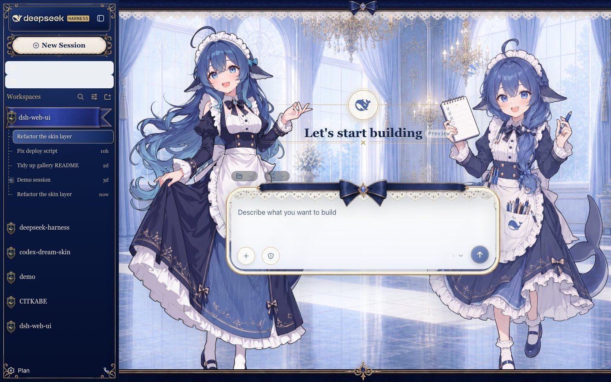
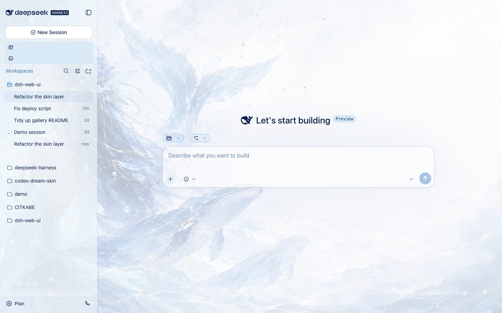
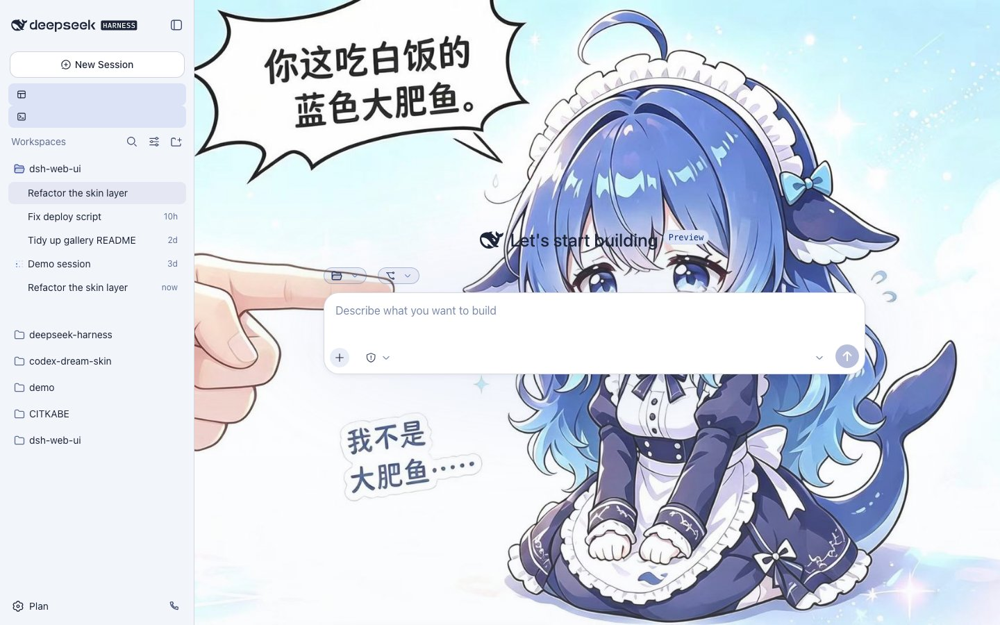

# dsh-skins · Skin Center for DeepSeek Harness (DSH)

English | [中文](README.zh.md)

<p align="center">
  
  &nbsp;
  
  &nbsp;
  
</p>

<p align="center">
  <strong>Theme & Personalization Engine for DeepSeek Harness (DSH) Web GUI & Desktop Client</strong><br>
  <em>Themes & Skins · Frosted Glass Blur · Custom Themes · Live Try-On · Wallpaper Engine via its dedicated plugin</em>
</p>

`@linxin666/dsh-client-ui-skin-center` (cordis plugin id `ui-skin-center`) is the single skin package of the dsh Web GUI: it puts the skin list / try-on / apply into the real GUI as the first-level Skin Center settings section (settings → 皮肤中心, listing only installed skins), and it is the only loader and renderer for skins. A skin is a pure asset directory — no package.json, no npm publish, no cordis wiring — that couples only to the skin-center contract (`contracts/`); the skin center absorbs every official-DSH coupling behind that contract. The card carries its own enable switch (off disables try-on, apply and the background controls).

- List: shows "官方默认" (official default) plus every installed skin in the catalog with its name, tagline and accent color; the currently active target carries the Active marker. The catalog merges two sources: the default skin shipped inside this package (`skins/blue-fantasy/`) and user skins dropped into `$DSH_HOME/skins/<id>/` (a user skin with the same id shadows the built-in one). Every other skin of the collection is a market item: install it on demand from the DSH Market store (one-click install) into `$DSH_HOME/skins/<id>/`, where this same catalog manages it as a user skin — no restart, reopen the card or reload to pick it up. Skins whose `skin.json` fails validation are excluded fail-closed and reported as catalog diagnostics.
- Custom theme: the final card is a user-level theme derived from the official stock look, separate from both the official-default card and catalog skins. Light and dark profiles independently edit accent, background, foreground and contrast (0–100), with live try-on, apply, current-mode reset and reload persistence. Its generated CSS is limited to an audited official-token allowlist; it cannot accept selectors, arbitrary CSS or asset URLs. Catalog skin definitions are never modified, and an active catalog skin automatically suppresses the custom-theme layer.
- Try-on / Apply: both go through the same atomic switch engine (`src/client/runtime/skin-controller.ts`). One switch is one new activation identity: fetch the scoped stylesheet, install it plus the background media and optional hooks, flip `html[data-dsh-skin="<id>"]`, then dispose the previous activation (append-only effect ledger, idempotent teardown). The latest request always wins; a failed or superseded switch leaves the previous skin fully intact. Try-on is the same switch without persistence — "Exit try-on" restores the committed skin. Apply persists the selection (`POST /api/skin-center/v2/active`). No page reload, no `cordis.patch.yml` rewrite, no boot-graph regeneration.
- First paint: the host half registers one index.html transform (`webServer.tapIndex`, single adapter module `src/tap-index-adapter.ts`) that stamps `html[data-dsh-skin]` and inserts the stylesheet links into every served document, so a reload boots straight into the active skin with no flash of the stock look. The tap fails closed to the stock look on any problem.
- Skin format (v2): `skin.json` (validated fail-closed, v1 fields `package`/`wiring`/`bodyAttr` ignored with migration warnings), `skin.css` (L1 token remaps + L2 semantic selectors), optional `patches.css` (L3 free selectors, high sensitivity), optional `hooks.mjs` (trusted escape hatch, high sensitivity), `assets/`, `preview/`. All CSS passes the safety pipeline (`src/core/css-safety/transform.ts`): every selector is force-scoped under `html[data-dsh-skin]`, `@import` / remote or protocol-relative URLs / escaping paths are hard errors. See `contracts/README.md`.
- Coverage contract: L1 remaps the official `--dsw-*` design tokens; L2 styles the semantic attributes (`data-dsh-surface` / `data-dsh-part` / `data-dsh-plugin`, enumeration in `contracts/semantic-attrs-v1.md`) which a compat adapter (`src/client/runtime/semantic-adapter.ts`) stamps onto the official shell DOM from stable anchors (`data-slot` outlets, `data-chat-flow-kind`, etc.); L3 patches carry any selector at the skin author's own risk. Plugins that output the semantic attributes themselves get the full L2 coverage; plugins that do not only get L1. A shared shell-rendering adapter applies only while a catalog skin or a custom theme is active: it removes the workspace-list end fade, gives the composer placeholder an opaque theme-secondary text color, and reserves bottom clearance on conversation scrollports so messages remain readable above the sticky composer (#978), so individual skins do not need duplicate patches.
- Background priority: while a wallpaper renders, the skin and its background media stand down entirely (see "Wallpaper Engine"), so the wallpaper always has the backdrop to itself; otherwise the skin's manifest background media is the backdrop.
- Background controls: a background-occlusion slider (0–100%) veils the backdrop behind the panels for skins that paint one, two per-state Gaussian-blur sliders (0–20 px) control the backdrop for empty and populated conversations, an input-card blur slider (0–20 px) controls only the frosted area behind the composer, and a bubble-opacity slider (0–100%) drives translucent message bubbles for skins that expose bubble alpha. The active background blur uses a fixed `backdrop-filter` element behind the shell; 0 disables it entirely (no element, no GPU cost). The input-card frost rides its own body-level fixed follower (the `data-dsh-composer-frost` element) sized to the composer card, never the card itself: a `backdrop-filter` on the card would make it the containing block for the shell's fixed tooltips inside it and jolt the conversation on every hover.
- Legacy migration: on the first boot after the v2 upgrade, a one-shot bridge (`src/legacy-bridge.ts`) reads the retired `dsh-skin` managed section from the harness home `cordis.patch.yml` (where the v1 CLI wrote it; the active profile's `cordis.patch.yml` is probed as a secondary location), migrates the active skin id into the v2 selection store, and strips the legacy rows. The migration is idempotent and fails closed (the old state stays untouched on any error). It logs only when it migrated, cleaned, or failed — the nothing-to-migrate steady state stays silent (issue #788).


## Core Capabilities & Scenarios

| User Goal & Scenario | Stock DSH Web Limitation | Skin Center (dsh-skins) Solution |
|---|---|---|
| Personalized aesthetics and eye-care dark theme | Default single monochrome theme only | Bundled Blue Fantasy dark theme + one-click install for dozens of curated themes from Workshop |
| Interactive dynamic wallpaper via Wallpaper Engine | No dynamic video or animated wallpaper support | Delegated to the dedicated dsh-wallpaper-engine plugin (video, web, and 2D/3D WebGL real-time scenes), which this card installs from and hands the backdrop to |
| Frosted glass blur & composer scrim controls | Flat background with no visual depth or layering | Background scrim (0–100%), adaptive conversation blur, follower frosted composer glass & bubble opacity |
| Custom brand palette & CSS token remapping | Unable to tweak accent colors or contrast | Independent light/dark accent, background, foreground and contrast tuning with audited CSS token coverage |
| Live theme try-on and zero-flash hot switching | Theme changes require server restarts or reloads | Atomic hot-switch engine for live preview, clean rollback, and instant boot without white FOUC flashes |

## Most popular skins

The three most-liked skins in the Workshop's skin category on [dsh-market.com](https://dsh-market.com), in the site's default popularity order:

| Skin | Author | Look |
|---|---|---|
| [Abyssal Maid Atelier](https://dsh-market.com/#skin:maid-atelier) (`maid-atelier`) | Small-tailqwq | Twin-maid atelier backdrop, deep-sea blue lace surfaces and a chibi sidebar |
| [Whale Song](https://dsh-market.com/#skin:whale-song) (`whale-song`) | dsh-web | Deep-sea whale goddess backdrop, ice-blue ocean palette and gold hairlines |
| [Blue Fantasy](https://dsh-market.com/#skin:blue-fantasy) (`blue-fantasy`) | powerdog996 (DreamSkin community), adapted by dsh-web | Whale-illustration backdrop, periwinkle indigo palette and translucent panels |

| Abyssal Maid Atelier | Whale Song | Blue Fantasy |
|---|---|---|
|  |  |  |

Install any of them from the Workshop in one click; `blue-fantasy` is also the skin this package ships as its built-in default.

## Install

```sh
dsh plugin --profile web add @linxin666/dsh-client-ui-skin-center
# From the repo (dev): dsh plugin --profile web add link:$(pwd)/packages/skins/skin-center
```

`$(pwd)` is your clone of the dsh-web monorepo. Only the default skin (blue-fantasy) ships inside this package; every other skin installs on demand from dsh-market.com into `$DSH_HOME/skins/<id>/`, and community skins are plain directories in the same place (no install command, no restart — reopen the card or reload to pick them up). A fresh install activates blue-fantasy by default (host seed); an update whose active skin is no longer available falls back to the stock look. The package ships `skins/blue-fantasy` only; the remaining skins stay in the repository under `skins/` as the market-build source and are never published in the package.

skin-center is a self-contained bundle meeting the official DSH plugin standard (`dsh.bundle.patch` points to `cordis.patch.yml`); it can also be installed via git: `dsh plugin --profile web add github:<org>/dsh-web#<sha>` (the `prepare` script builds `lib/` in place). pnpm ≥10 requires authorizing `allowBuilds` before installing a git dependency; a local `link:` install has no such requirement.

## Wallpaper Engine

Wallpaper Engine support is **not bundled** here. It lives in its own plugin, [dsh-wallpaper-engine](https://github.com/elysia395/dsh-wallpaper-engine) (`dsh-plugin-wallpaper-engine`), which owns the wallpaper library, the video / web / scene rendering paths, the wallpaper settings surface and the glass over the wallpaper.

```sh
dsh plugin --profile web add dsh-plugin-wallpaper-engine
```

Restart the host afterwards (`dsh web`; DSH Desktop: fully quit the app and reopen it). The plugin adds its own settings page for choosing and tuning wallpapers; the skin center card points at it when it is missing.

### How the two share the page

The two plugins take turns rather than overlapping, and the handoff is automatic:

- **While a wallpaper renders**, the plugin stamps the stable `body[data-we-wallpaper]` attribute. The skin center reads that attribute and **stands its own visual work down**: no skin CSS, no skin background art, no hooks, no composer frost, and the `html[data-dsh-skin]` stamp comes off the page. Whatever you picked in the skin center is remembered but not painted — that plugin rewrites the same shell and paints its own glass, so anything else would fight it.
- **When the wallpaper stops**, the attribute clears and the remembered skin repaints on its own, with no reload and no re-applying.

The card says so while it is standing down, so a paused skin reads as a state, not as a bug. A skin you apply during a wallpaper is still persisted and takes effect when the wallpaper stops. The skin center never writes the plugin state, and the plugin never writes the skin center state.

### Skins and wallpapers

Skin background art is part of a skin own look, so it is withheld together with the rest of the skin while a wallpaper renders. Skins that ship their own full-bleed plate (the ground-plate canvases in the catalog) additionally key their yield rules on `body[data-we-wallpaper]`, so they step aside rather than compete for the backdrop.

## Configuration

- **Enable switch**: turns the whole card (try-on / apply / background controls) on or off; persisted in the v2 active-state document.
- **Background sliders**: occlusion (0–100%), two backdrop blur radii, input-card blur (0–20 px), and bubble opacity (0–100%); persisted in the same v2 document.
- **Background persistence (remote-capable)**: background values live in the v2 active-state document (`$DSH_HOME/skin-center-active.json`, the `background` section) and are read/written through `GET|POST /api/skin-center/v2/active`, so paired remote desktops — where the settings surface is loopback-only — load and keep them across sessions. The `skin-background` section of the plugin's own configuration stays as the settings page's input face: a customized section is migrated into the v2 store once at boot, and later page edits are forwarded by the client. Card edits do not write back to that page, so it may show stale values until its next edit.
- **Custom theme**: light/dark accent, background, foreground and contrast profiles plus the applied marker; persisted as a versioned contract in the `skin-custom-theme` section of the plugin's own configuration.
- **Wallpaper settings**: not part of this configuration. They belong to `dsh-plugin-wallpaper-engine`, which serves its own settings page; a retired `skin-wallpaper` section left in an older profile is ignored and never rewritten.
- **Where these settings live**: the two sections are one plugin configuration — the profile entry's own `Config`. The Host derives that entry's settings page from the schema in the GUI, and the card writes the same values; there is no separate settings document.
- **User skin directory**: `$DSH_HOME/skins/<id>/`; override precedence is `DSH_SKINS_HOME`, then `DSH_SKINS_DIR`, then `$DSH_HOME/skins`.

## Security model

- All `/api/skin-center/*` routes are same-origin only: writes reject cross-site requests (Sec-Fetch-Site / Origin fence), and asset reads are contained inside each skin directory (path escapes fail closed).
- Skin CSS is sanitized (whitelist) before serving; `patches.css` (L3) is arbitrary CSS by design and disclosed as such — it runs with full page styling power and is not a security boundary.
- The custom-theme editor emits only fixed declarations from `CUSTOM_THEME_ALLOWED_TOKENS`, each verified against the official token registry. User input is normalized color/contrast data and never becomes a selector, URL or free-form CSS payload.
- `hooks.mjs` is trusted code that shares this repository's review and release; it is served same-origin only and its import/apply errors can never take the static skin down. Hooks run for built-in skins and for user-directory skins whose executable identity is byte-verified as reviewed official-market content: current Workshop installs use `dsh-market.provenance.json`, while legacy pre-provenance installs must match the generated `src/reviewed-hooks.generated.ts` identity for id, declared entry, complete `skin.json`, and hooks bytes (verified by `src/provenance.ts`, issue #1073). The fallback is read-only and offline; any modified, renamed, hand-dropped, or tampered directory keeps the hooks facet refused while the declarative parts still load.

## Known limitations

- Inline styles written by plugins at runtime can only be overridden by L3 `!important` patches.
- Plugins that do not output semantic attributes (and have no stable DOM anchors) receive L1 token coverage only.
- Wallpaper pause-on-hidden, wallpaper blur, dimming and sound live in `dsh-plugin-wallpaper-engine`'s own settings; the skin center has no wallpaper controls and its card only reports the plugin's state.

## Telemetry

The browser half sends one anonymous install heartbeat per UTC day to dsh-market.com: a random localStorage id plus this package's name, nothing else. The server stores only a salted hash of that id, never IP addresses, and exposes aggregate counts only. See [docs/telemetry.md](../../docs/telemetry.md) for the full contract.

## Directory structure

```
skins/skin-center/
  contracts/                                # the skin-facing contract surface (schema, hooks API, semantic attrs)
  src/core/manifest-v2/                     # manifest v2 types + fail-closed validator
  src/core/css-safety/                      # lightningcss scoping + whitelist pipeline
  src/index.ts                              # host entry: routes, tapIndex adapter, legacy bridge
  src/skin-repo.ts                          # dual-source skin catalog (built-in + $DSH_HOME/skins)
  src/provenance.ts                         # official-market install provenance verification (hooks trust)
  src/routes-v2.ts                          # /api/skin-center/v2/* routes
  src/tap-index-adapter.ts                  # the single tapIndex adapter (anti-FOUC)
  src/active-state.ts                       # active-skin selection persistence
  src/legacy-bridge.ts                      # one-shot v1 → v2 migration
  src/http-utils.ts / harness-home.ts       # shared route helpers / DSH path resolution
  src/client/runtime/                       # effect ledger, decoration layers, semantic adapter, switch controller, boot store
  src/client/SkinCenter.tsx                 # the settings card
  src/core/custom-theme.ts                  # versioned palette contract + audited token-only CSS generator
  src/client/custom-theme-controller.ts / CustomThemePanel.tsx            # persistence/runtime owner + editor card
  src/client/background.ts                  # scrim + blur controls
  src/external-wallpaper.ts                 # read-only probe of the delegated wallpaper plugin
  src/client/runtime/external-wallpaper-engine.ts   # stands skins down while that plugin renders
  skins/<id>/                               # built-in skins (pure asset directories)
```

## Acceptance checklist

- [x] The skin-center section appears in 设置 → 皮肤中心 without console errors
- [x] The list shows the official default plus every catalog skin; the active one is marked; invalid skins surface as diagnostics
- [x] Try-on takes effect immediately and Exit restores the committed skin; only one skin is ever on the page
- [x] One-click apply switches atomically with no reload; a later page load boots straight into the skin (no FOUC)
- [x] The custom theme keeps independent light/dark profiles, survives reload, and never overrides an active catalog skin
- [x] Background scrim and blur controls are unaffected by skin switches
- [x] While the delegated wallpaper plugin renders, no skin, glass or background art from this plugin is on the page, and the remembered skin returns when it stops
